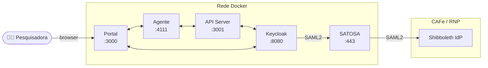
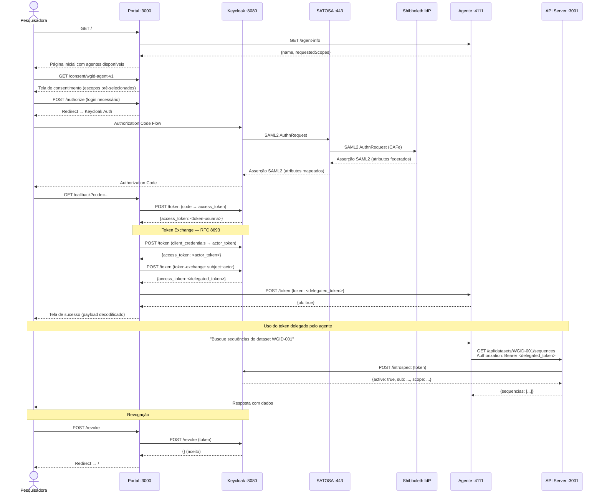

# Gerenciamento de Identidade de Agentes de IA em Federações — Documentação Técnica

> **Experimento** desenvolvido no contexto do GIdLab  para demonstrar como identidades federadas via CAFe podem ser delegadas a agentes de inteligência artificial utilizando protocolos e recomendações atuais.

---

## Sumário

1. [Visão Geral](#1-visão-geral)
2. [Arquitetura](#2-arquitetura)
3. [Pré-requisitos](#3-pré-requisitos)
4. [Configuração do Ambiente](#4-configuração-do-ambiente)
5. [Fluxo da Demonstração](#5-fluxo-da-demonstração)
6. [Protocolos e Recomendações Adotados](#6-protocolos-e-recomendações-adotados)

---

## 1. Visão Geral

### 1.1 Objetivo

Esta demonstração mostra como o gerenciamento de identidade de agentes de IA pode ser integrado ao ecossistema de federações de identidade acadêmicas — em particular à **Comunidade Acadêmica Federada (CAFe)** da RNP — utilizando protocolos abertos e recomendações em vigor.

O cenário central é: uma pesquisadora autenticada via federação CAFe autoriza um **agente de IA** a acessar dados científicos e submeter jobs em clusters HPC **em seu nome**, com escopos limitados e rastreabilidade completa.

### 1.2 Problema que a Demonstração Resolve

Agentes de IA precisam acessar recursos protegidos (APIs, dados, infraestrutura HPC) em nome de usuários reais. Sem um mecanismo de delegação padronizado, as alternativas comuns são inseguras:

| Abordagem insegura | Problema |
|---|---|
| Compartilhar credenciais do usuário com o agente | Viola o princípio do menor privilégio; sem rastreabilidade |
| Criar credenciais técnicas separadas para o agente | O agente age em nome próprio, não do usuário — sem identidade delegada |
| Copiar e colar tokens manualmente | Operacionalmente inviável; sem revogação |

Esta PoC demonstra que o **OAuth 2.0 Token Exchange (RFC 8693)** resolve esse problema: o agente recebe um token derivado das credenciais do usuário, com escopos reduzidos, rastreável e revogável, sem que o usuário precise compartilhar sua senha ou token primário.

### 1.3 Tecnologias e Protocolos

| Camada | Tecnologia |
|---|---|
| Federação de identidade | SATOSA 8.5.1 (proxy SAML2-to-SAML2) + Shibboleth IdP (CAFe) |
| Servidor de autorização | Keycloak 26.6.4 (Standard Token Exchange V2) |
| Portal de delegação | Node.js 22 + Express 4 + EJS |
| Agente de IA | Mastra v1.45.0 (TypeScript) |
| API protegida | Node.js 22 + Express 4 |
| Infraestrutura | Docker Compose |
| Protocolo de delegação | RFC 8693 — OAuth 2.0 Token Exchange |
| Verificação de revogação | RFC 7662 — OAuth 2.0 Token Introspection |
| Revogação de tokens | RFC 7009 — OAuth 2.0 Token Revocation |
| Autenticação federada | SAML 2.0 |
<!-- | Atributos federados | eduPersonEntitlement (AARC-G069) | -->

---

## 2. Arquitetura

### 2.1 Componentes



#### Portal de Delegação (`portal/`)

Aplicação web Express que implementa o fluxo OAuth 2.0 do ponto de vista do usuário. Responsabilidades:

- Autenticar a pesquisadora via Keycloak (Authorization Code Flow)
- Descobrir dinamicamente os escopos que o agente necessita (via `GET /agent-info`)
- Apresentar tela de consentimento com seleção granular de escopos
- Executar o Token Exchange (RFC 8693) servidor-a-servidor
- Entregar o token delegado ao agente via push server-to-server autenticado
- Permitir revogação da delegação

#### Agente de IA (`agent/`)

Agente Mastra (TypeScript) que utiliza o token delegado para chamar a API. Responsabilidades:

- Expor endpoint `GET /agent-info` — autodescoberta de identidade e escopos
- Expor endpoint `POST /token` — receber token delegado do portal via push seguro
- Armazenar o token em `tokenStore` (memória volátil)
- Usar o token em todas as chamadas à API via ferramentas (`buscarSequencias`, `submeterJob`)

#### API Server (`api_server/`)

API Express que representa um serviço científico protegido. Responsabilidades:

- Validar cada requisição via **Token Introspection** (RFC 7662) no Keycloak
- Rejeitar tokens revogados ou expirados (`active: false`)
- Verificar escopos OAuth antes de executar cada operação
- Gravar log de auditoria de cada acesso

#### Keycloak

Servidor de autorização central. Responsabilidades:

- Autenticar usuários federados recebidos via SATOSA/SAML2
- Emitir tokens de acesso (Authorization Code Flow)
- Executar o Token Exchange (RFC 8693 Standard Token Exchange V2)
- Responder a consultas de introspection (`/token/introspect`)
- Processar revogações (`/revoke`)

#### SATOSA

Proxy de protocolo SAML2-to-SAML2. Responsabilidades:

- Receber asserções SAML2 do Shibboleth IdP da CAFe
- Traduzir e reencaminhar atributos para o Keycloak (atuando como SP perante o IdP e como IdP perante o Keycloak)
- Mapear `eduPersonEntitlement` e demais atributos federados


### 2.2 Fluxo de Comunicação



---

## 3. Pré-requisitos

### 3.1 Softwares Necessários

| Software | Versão mínima | Finalidade |
|---|---|---|
| Docker | 24.x | Orquestração de contêineres |
| Docker Compose | 2.x (plugin) | Subir todos os serviços |
| Node.js | 22.13.0 | Desenvolvimento local (portal, api_server, agente) |

> **Nota:** Node.js só é necessário para desenvolvimento local fora do Docker. Para rodar a PoC completa, apenas Docker e Docker Compose são obrigatórios.

### 3.2 Conta de API de LLM

O agente utiliza o modelo `google/gemini-2.5-flash`. É necessária uma **Google Gemini API Key** para que o agente processe mensagens.

### 3.3 Dependências de Rede

- Porta **3000** (Portal)
- Porta **3001** (API Server)
- Porta **4111** (Agente Mastra)
- Porta **8080** (Keycloak)
- Porta **443** (SATOSA — opcional, necessário apenas para integração CAFe)

---

## 4. Configuração do Ambiente


> [!WARNING]  
> Os arquivos de configuração possuem chaves e tokens públicamente configurados apenas para agilizar a instalação da demonstração.

### 4.1 Obter o Código-Fonte

```bash
git clone https://github.com/mariamandafm/wgid-ai-agent wgid
cd wgid
```

### 4.2 Configurar Variáveis de Ambiente

Cada serviço possui seu próprio arquivo `.env`. **Nunca commite esses arquivos** — o `.gitignore` já os exclui.

```bash
cp api_server/.env.example api_server/.env
cp agent/.env.example agent/.env
cp satosa/.satosa_env.example satosa/.satosa_env
cp portal/.env.example portal/.env
```


### 4.3 Inicializar os Serviços

```bash
# Primeira execução (ou após mudanças de código)
docker compose up --build

# Execuções subsequentes
docker compose up -d
```

### 4.4 Acessar os Serviços

| Serviço | URL | Credenciais |
|---|---|---|
| Portal de Delegação | `http://localhost:3000` | — |
| Keycloak Admin | `http://localhost:8080` | `admin` / `admin` |
| Mastra Studio (dev) | `http://localhost:4111` | — |
| API Server (health) | `http://localhost:3001/health` | — |
| Audit Log | `http://localhost:3001/audit` | — |

---

### 4.5 Configuração do Agente
Em `agente/.env` é preciso informar as chaves geradas pelo Google Gemini API Key

```
# Google Gemini API Key
GOOGLE_API_KEY=<sua-chave-google-gemini>
```

### 4.6 Configurar o Keycloak

> Ao subir com `docker compose up`, o Keycloak importa
> `keycloak/realm-import.json` no boot (`--import-realm`) e cria o realm, os 3
> clients, os client scopes e os audience mappers descritos abaixo, nenhuma
> configuração manual é necessária. Os secrets dos clients confidenciais já
> vêm pré-preenchidos nos `.env.example` (`wgid-agent-v1-dev-secret` e
> `api-server-dev-secret`), então `cp .env.example .env` já funciona sem
> editar nada.

Acesse `http://localhost:8080` (após subir o Keycloak) com as credenciais `admin/admin`.

O Keycloak possui as seguintes configurações:

#### Realms

* `agents`

#### Clients

* `delegation-portal` (portal)
  * Possui o `wgid-agent-v1` configurado como audience.

* `wgid-agent-v1` (agente)
  * Possui o Token Exchange habilitado e o `api-server` como audience.

* `api-server` (API)
  * Apenas para Token Introspection, não precisa de flows habilitados

#### Scopes OAuth

| Nome | Tipo |
|---|---|
| `genomica:read` | Optional |
| `hpc:submit` | Optional |

Ambos são optional scopes do client `wgid-agent-v1`.

#### Integração com SATOSA

Para que o Keycloak aceite autenticação via SATOSA, é necessário cadastrar o SATOSA como Identity Provider no Keycloak e trocar os metadados SAML2 entre os dois.

**1. Criar o IdP no Keycloak**

1. Baixe os metadados do IdP do SATOSA em `https://localhost/Saml2IDP/proxy.xml`.
2. No Keycloak, acesse **Identity providers > SAML v2.0**.
3. Preencha:
   * **Display Name:** `Federação`
   * Desabilite **Use entity descriptor**.
4. Com a opção desabilitada, o campo **Import config from file** aparece — selecione o arquivo `proxy.xml` baixado no passo 1. Os demais campos do IdP são preenchidos automaticamente a partir do metadado.
5. Marque **Want AuthnRequests signed**, **Want Assertions signed** e **Want Assertions encrypted**.
6. Clique em **Add**.
   
**2. Configurar os mappers no Keycloak**

Em **Identity providers > Federação > Mappers > Add mapper**, crie um mapper de importação de atributo para cada atributo abaixo:

| Name | Sync mode override | Mapper type | Friendly Name | User Attribute Name |
|---|---|---|---|---|
| Mail | Import | Attribute Importer | `mail` | `email` |
| Name | Import | Attribute Importer | `givenName` | `firstName` |
| LastName | Import | Attribute Importer | `sn` | `lastName` |

**3. Exportar os metadados do Keycloak para o SATOSA**

1. Os metadados do Keycloak ficam disponíveis em `http://localhost:8080/realms/agents/broker/saml/endpoint/descriptor`.
2. Baixe esse metadado e salve em `satosa/volumes/keycloak.xml`.


### 4.7 Configurar o SATOSA (Integração CAFe)

O SATOSA atua como SP perante o Shibboleth IdP da CAFe e como IdP perante o Keycloak.

```
satosa/volumes/
├── proxy_conf.yaml          # Configuração principal (BASE URL, plugins)
├── internal_attributes.yaml # Mapeamento de atributos (inclui eduPersonEntitlement)
├── plugins/
│   ├── backends/
│   │   └── saml2_backend.yaml   # Configuração do SP (consome assertções do IdP CAFe)
│   └── frontends/
│       └── saml2_frontend.yaml  # Configuração do IdP virtual (serve o Keycloak)
└── metadata/                # Metadados SAML2 do IdP CAFe
```

**1. Configurar os Plugins**

* **Frontend (IdP):** já está configurado para ler o metadado local `keycloak.xml`, nenhuma alteração é necessária.
* **Backend (SP):** o SATOSA se comunica com a federação, portanto é necessário estabelecer a relação de confiança com o servidor de descoberta da federação:

  ```yaml
  metadata:
    remote:
      - url: <url-servidor-descoberta-federação>
  ```

  Para uma configuração mais simples (sem depender do servidor de descoberta), coloque o metadado do IdP Shibboleth em `satosa/volumes/` e referencie-o localmente:

  ```yaml
  metadata:
    local:
      - idp-local.xml
  ```

> [!IMPORTANT]
> Os metadados da interface SP do SATOSA também precisam ser enviados ao IdP/federação, para que a relação de confiança seja estabelecida nos dois sentidos.
> Esses metadados são disponibilizados em: https://localhost/Saml2/proxy_saml2_backend.xml

**2. Reiniciar o SATOSA**

```bash
docker compose restart satosa
```

Para a PoC funcionar **sem** a CAFe, crie usuários diretamente no Keycloak (realm `agents`). O SATOSA só é necessário para autenticação com credenciais institucionais reais.
---


## 5. Fluxo da Demonstração

### Etapa 1 — Descoberta do Agente

**URL:** `http://localhost:3000`

O portal chama `GET http://agent:4111/agent-info` e renderiza os agentes disponíveis com seus escopos.

```
Portal → Agente: GET /agent-info
Agente → Portal: {
  id: "wgid-agent-v1",
  name: "Assistente de Análise Genômica",
  requestedScopes: [
    { name: "genomica:read", label: "Leitura de sequências genômicas" },
    { name: "hpc:submit",    label: "Submissão de jobs HPC" }
  ]
}
```

**Componentes envolvidos:** Portal, Agente

**Conceito demonstrado:** Autodescoberta de identidade do agente — o portal não possui configuração estática de escopos; eles são declarados pelo próprio agente.

---

### Etapa 2 — Autenticação da Pesquisadora

**URL:** `http://localhost:3000/login` → redirect para Keycloak

A pesquisadora se autentica via Keycloak (que, na integração completa, redireciona para o Shibboleth IdP da CAFe via SATOSA). O resultado é um **access token** emitido para o client `delegation-portal`, representando a identidade da pesquisadora.

```
Browser → Keycloak: Authorization Code Request
Keycloak → Shibboleth/SATOSA: SAML2 AuthnRequest  [se integrado à CAFe]
Shibboleth → SATOSA → Keycloak: Asserção com atributos
Keycloak → Browser: Authorization Code
Browser → Portal: GET /callback?code=...
Portal → Keycloak: POST /token (code → access_token)
```

**Componentes envolvidos:** Portal, Keycloak, SATOSA (opcional), Shibboleth IdP (opcional)

**Conceito demonstrado:** Autenticação federada — a identidade da pesquisadora é proveniente da instituição de ensino (via CAFe/SAML2), não de um cadastro local no portal.

---

### Etapa 3 — Consentimento e Seleção de Escopos

**URL:** `http://localhost:3000/consent/wgid-agent-v1`

O portal exibe os escopos que o agente solicita, com checkboxes pré-selecionados. A pesquisadora pode desmarcar escopos antes de confirmar, reduzindo o privilégio delegado.

**Componentes envolvidos:** Portal (frontend), Browser

**Conceito demonstrado:** Consentimento granular — alinhado com a abordagem de assistentes de IA no mercado (Google OAuth, Microsoft Entra External ID, Amazon Cognito), onde o usuário decide quais permissões conceder.

---

### Etapa 4 — Token Exchange (RFC 8693)

**URL:** `POST /authorize` (form submit da tela de consentimento)

O portal executa o fluxo de delegação em duas chamadas servidor-a-servidor ao Keycloak:

**Passo 4a — Obter actor token do agente:**
```http
POST /realms/agents/protocol/openid-connect/token
Content-Type: application/x-www-form-urlencoded

grant_type=client_credentials
&client_id=wgid-agent-v1
&client_secret=<secret>
```

**Passo 4b — Token Exchange:**
```http
POST /realms/agents/protocol/openid-connect/token
Content-Type: application/x-www-form-urlencoded

grant_type=urn:ietf:params:oauth:grant-type:token-exchange
&subject_token=<token-da-pesquisadora>
&subject_token_type=urn:ietf:params:oauth:token-type:access_token
&actor_token=<token-do-agente>
&actor_token_type=urn:ietf:params:oauth:token-type:access_token
&requested_token_type=urn:ietf:params:oauth:token-type:access_token
&client_id=wgid-agent-v1
&client_secret=<secret>
&scope=genomica:read hpc:submit
&audience=api-server
```

O token resultante tem `sub` = pesquisadora, `azp` = `wgid-agent-v1`, `aud` inclui `api-server`.

**Componentes envolvidos:** Portal, Keycloak

**Conceito demonstrado:** Delegação padronizada via RFC 8693 — o token delegado carrega a identidade da pesquisadora (`sub`) e identifica o agente como parte autorizada (`azp`). A `audience` restringe o uso exclusivamente à API Server.

---

### Etapa 5 — Entrega do Token ao Agente (Push)

Após o Token Exchange, o portal entrega o token ao agente via chamada servidor-a-servidor autenticada:

```http
POST http://agent:4111/token
x-push-secret: <PUSH_SECRET>
Content-Type: application/json

{ "token": "<delegated_token>" }
```

O agente armazena o token em `tokenStore.token` (objeto mutável em memória). A partir deste momento, todas as chamadas de ferramentas usam este token.

**Componentes envolvidos:** Portal, Agente

**Conceito demonstrado:** Entrega segura sem intervenção manual — nenhuma cópia e colagem de token. O `PUSH_SECRET` garante que apenas o portal autorizado pode atualizar o token do agente.

---

### Etapa 6 — Uso do Token pelo Agente

A pesquisadora interage com o agente via Mastra Studio ou API. O agente chama as ferramentas disponíveis, que incluem o token delegado em cada requisição à API:

**Ferramenta `buscarSequencias`:**
```http
GET /api/datasets/WGID-001/sequences
Authorization: Bearer <delegated_token>
```

**Ferramenta `submeterJob`:**
```http
POST /api/jobs/submit
Authorization: Bearer <delegated_token>
Content-Type: application/json

{ "parametros": { "threads": 8, "memoria": "16GB" } }
```

**Componentes envolvidos:** Agente, API Server, Keycloak

**Conceito demonstrado:** Acesso autorizado com identidade delegada — a API vê a identidade da pesquisadora no token, não um service account anônimo.

---

### Etapa 7 — Validação via Token Introspection (RFC 7662)

Para **cada requisição** recebida, a API Server consulta o Keycloak:

```http
POST /realms/agents/protocol/openid-connect/token/introspect
Authorization: Basic <api-server:secret em base64>
Content-Type: application/x-www-form-urlencoded

token=<delegated_token>
```

Resposta do Keycloak:
```json
{
  "active": true,
  "sub": "<uuid-da-pesquisadora>",
  "azp": "wgid-agent-v1",
  "scope": "genomica:read hpc:submit",
  "preferred_username": "ana.silva@ufrn.br",
  "exp": 1751490000
}
```

A API extrai `sub`, `azp`, `scope` e registra no audit log:

```json
{
  "timestamp": "2026-07-02T14:23:01.000Z",
  "user": "ana.silva@ufrn.br",
  "agent": "wgid-agent-v1",
  "is_delegated": true,
  "action": "buscar-sequencias",
  "resource": "WGID-001",
  "scope_used": "genomica:read",
  "status": "Success",
  "act_claim_present": false
}
```

**Componentes envolvidos:** API Server, Keycloak

**Conceito demonstrado:** Validação stateful — ao contrário da validação JWT local (que ignora revogação), a introspection consulta o Keycloak a cada chamada, garantindo que tokens revogados sejam rejeitados imediatamente.

---

### Etapa 8 — Revogação

**URL:** `http://localhost:3000/delegations` → botão "Revogar"

```http
POST /revoke
```

O portal executa:
1. Chama `POST /realms/agents/protocol/openid-connect/revoke` no Keycloak
2. Remove `delegated_token` da sessão local


---

## 6. Protocolos e Recomendações Adotados

### RFC 8693 — OAuth 2.0 Token Exchange

**Por quê:** É o padrão para delegação de identidade em OAuth 2.0. Permite que um agente receba um token derivado das credenciais de um usuário, com escopos limitados e identidade rastreável, sem acesso às credenciais originais.

**Como está implementado:**
- `subject_token`: token da pesquisadora (obtido via Authorization Code Flow)
- `actor_token`: token do agente (obtido via Client Credentials)
- `audience: api-server`: restringe o token ao único recurso que pode usá-lo
- `scope`: limitado aos escopos selecionados no consentimento

**Limitação do Keycloak 26.x:** O `act` claim (que identificaria o agente no token, conforme seção 4.4 do RFC 8693) ainda não é emitido no Standard Token Exchange V2. O workaround adotado usa o claim `azp` (Authorized Party) para identificar o agente.


### Princípio do Menor Privilégio

Os escopos delegados ao agente são um **subconjunto** dos escopos da pesquisadora, selecionados explicitamente no consentimento. O token delegado nunca tem mais permissões do que o necessário para as tarefas do agente.


